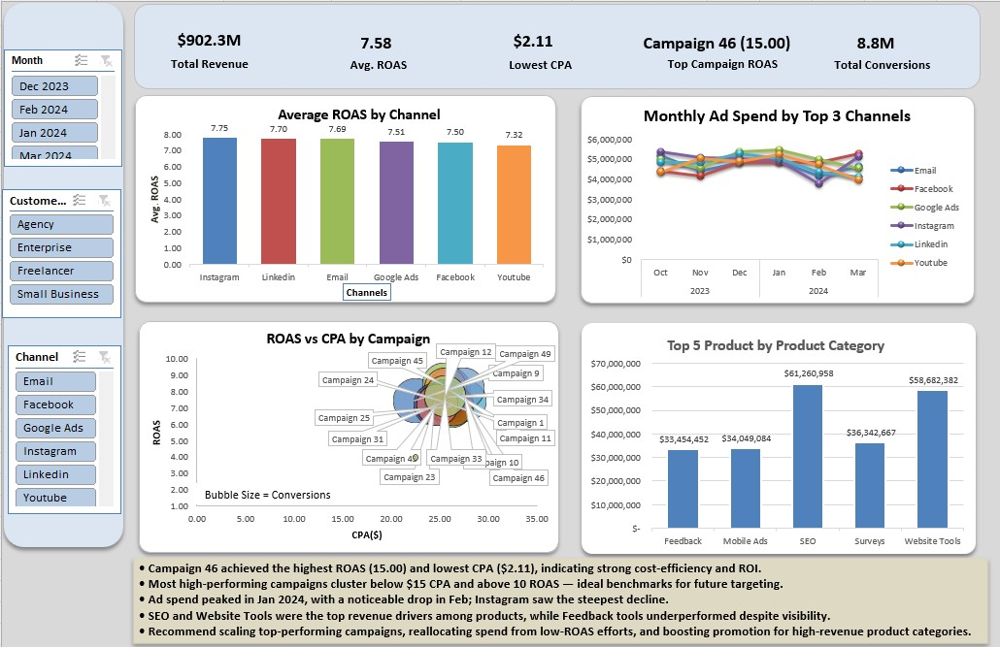
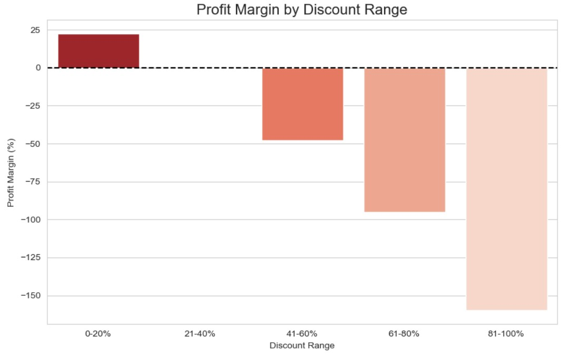
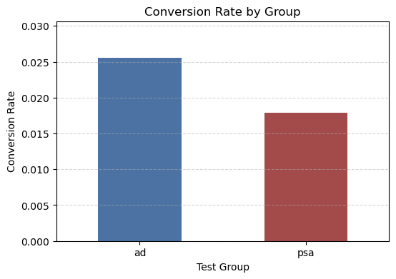
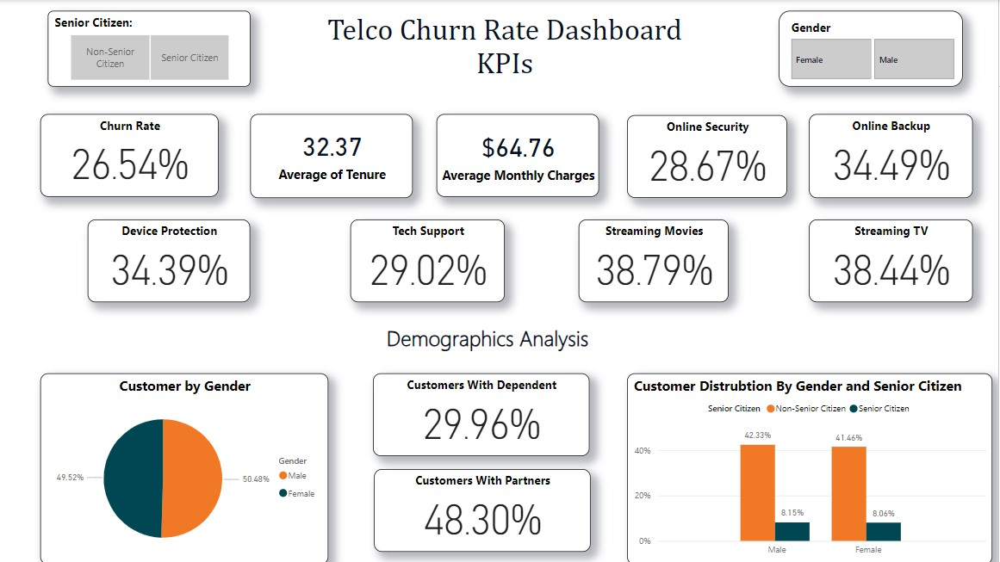

<!-- Wave Header -->

<!-- Profile Views Counter -->

  

<!-- Typing Animation -->

  

  <a href="https://m-bhurtel.github.io/" target="_blank"><strong>Portfolio</strong></a>
  &nbsp;&nbsp;|&nbsp;&nbsp;
  <a href="https://www.linkedin.com/in/mohanibhurtel/" target="_blank"><strong>LinkedIn</strong></a>
  &nbsp;&nbsp;|&nbsp;&nbsp;
  <a href="mailto:mohanilalbhurtel07@gmail.com"><strong>mohanilalbhurtel07@gmail.com</strong></a>

 

<!-- About Me Banner -->

 

I'm a London-based Data Analyst with a **Bachelor of Business Information Systems** (Asia Pacific International College, Sydney) and a Professional Year in IT. My work sits at the intersection of data quality, business analysis, and storytelling with numbers.

My career started at **Zither IT Consulting** in Sydney as a Business Analyst intern, where I gathered client requirements, ran CRM testing, and managed bug tracking with Asana on live projects. That experience taught me to think about data problems as business problems first.

Today I work at **dnata Catering UK**, certifying flight security documentation under **DfT regulations** with zero error tolerance. That standard of precision carries directly into how I clean, validate, and present data.

**What I bring to a data team:**

- Writing **SQL** with CTEs, window functions, joins, and aggregations to answer real business questions
- Building **Python pipelines** with Pandas and NumPy to clean, transform, and analyse datasets at scale
- Designing **Power BI and Excel dashboards** that turn findings into decisions stakeholders can act on
- Applying **statistical testing** to validate results and give clear, evidence-based recommendations

**Certifications:** CompTIA Data+ &nbsp;|&nbsp; Google Data Analytics &nbsp;|&nbsp; BCS Foundation in Business Analysis &nbsp;|&nbsp; SQL Intermediate (HackerRank)

Currently targeting **Junior Data Analyst and Reporting Analyst** roles in London. If you're hiring, let's talk.

 

<!-- Skills Banner -->

 

**Languages and Analysis**

**Libraries**

**Visualisation and Reporting**

**Tools and Platforms**

 

<!-- GitHub Stats Banner -->

 

  
  &nbsp;
  

  

<!-- Contribution Snake -->

  

 

<!-- Projects Banner -->

 

<table>
  <tr>
    <td width="50%" valign="top">
      <h3>Marketing Campaign Performance Dashboard</h3>
      
      
Analysed multi-channel campaign data to identify top performers. Uncovered campaigns with <strong>ROAS up to 15.0</strong> and delivered CPA breakdowns that showed exactly where budget was being lost.

      
<strong>Tech:</strong> Excel &nbsp;·&nbsp; Power Query &nbsp;·&nbsp; PivotTables

      <a href="https://github.com/M-Bhurtel/Marketing-Campaign-Performance-Dashboard" target="_blank">Repository</a>
    </td>
    <td width="50%" valign="top">
      <h3>Wonderland Sales and Customer Segmentation</h3>
      
      
SQL and Power BI project revealing that <strong>84.44% of revenue</strong> came from high-margin products and surfacing a <strong>$7M NSW revenue opportunity</strong> buried in regional segmentation data.

      
<strong>Tech:</strong> SQL &nbsp;·&nbsp; Power BI

      <a href="https://github.com/M-Bhurtel" target="_blank">Repository</a>
    </td>
  </tr>
  <tr>
    <td width="50%" valign="top">
      <h3>Global Mart Sales and Profitability EDA</h3>
      
      
In-depth EDA on the Global Superstore dataset uncovering a <strong>-0.51 discount-profit correlation</strong> with a clear tipping point: discounts above 20% consistently produce a net loss. Found that Office Supplies outperforms Technology in profitability with margins above 40%, and that Eastern Asia leads all regions through a disciplined low-discount strategy.

      
<strong>Tech:</strong> Python &nbsp;·&nbsp; Pandas &nbsp;·&nbsp; Matplotlib &nbsp;·&nbsp; Seaborn &nbsp;·&nbsp; Statsmodels

      <a href="https://github.com/M-Bhurtel/global-mart-eda" target="_blank">Repository</a>
    </td>
    <td width="50%" valign="top">
      <h3>Marketing A/B Test Analysis</h3>
      
      
Statistical test across <strong>588,101 records</strong>. Confirmed a <strong>+0.77% conversion lift</strong> at p-value below 0.0001, removing guesswork and delivering a clear go/no-go recommendation.

      
<strong>Tech:</strong> Python &nbsp;·&nbsp; Statsmodels &nbsp;·&nbsp; Pandas

      <a href="https://github.com/M-Bhurtel" target="_blank">Repository</a>
    </td>
  </tr>
  <tr>
    <td width="50%" valign="top">
      <h3>Telco Customer Churn Analysis</h3>
      
      
Analysed <strong>4,043 customers</strong> across a 3-page Power BI dashboard to uncover a <strong>26.54% churn rate</strong>. Found that electronic check users churn at <strong>15.21%</strong>, over 4x higher than bank transfer customers (3.66%), and that month-to-month contract holders are the highest-risk segment.

      
<strong>Tech:</strong> SQL (MS SQL Server) &nbsp;·&nbsp; Power BI

      <a href="https://github.com/M-Bhurtel/Telco-Churn-Analysis" target="_blank">Repository</a>
    </td>
    <td width="50%" valign="top">
    </td>
  </tr>
</table>

 

<!-- Building Next Banner -->

 

- Advanced SQL: window functions, query optimisation, and database design
- Machine Learning and Predictive Analytics
- Cloud Data Platforms: Azure and AWS

 

<!-- Connect Banner -->

 

  
  &nbsp;
  
  &nbsp;
  

<!-- Wave Footer -->

